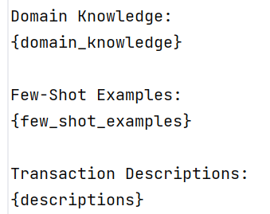
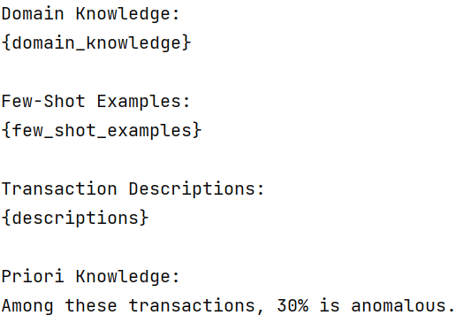

# Experiment Report
## Dataset:
CreditCard Dataset(Time,Amount,Class,V1-V28 for PCA components not used)
## Experiment Purpose

The purpose of this experiment is to investigate the performance of Large Language Models (LLMs) in anomaly detection tasks, specifically in the application of detecting fraudulent credit card transactions. By comparing the accuracy, precision, recall, and F1 scores of LLMs under different experimental settings, we can evaluate the effectiveness of LLMs in anomaly detection tasks and provide guidance for further research.

## Experiment Design

This experiment uses a real-world credit card transaction dataset and is divided into two parts:

- **Part 1 (Experiments 1-10):** LLMs are provided with domain knowledge, few-shot examples, and transaction descriptions from the test data as input to identify anomalous transactions.

- **Part 2 (Experiments 11-20):** In addition to the setup in Part 1, the proportion of labels in the test data is provided as prior knowledge to explore the impact of additional prior knowledge on LLMs' performance.

## Experiment Process

### Data Preparation

- Use the CreditCardFraudDataLoader class to load the credit card transaction dataset and split it into training and test sets.

### Experiment Loop

1. For each experiment, generate test data using different random seeds.
2. Save the test data to CSV files for subsequent accuracy calculation.
3. Sort and normalize the test data.
4. Generate textual descriptions of the test data.
5. Select few-shot examples from the training set.
6. Construct prompts including domain knowledge, few-shot examples, and textual descriptions of the test data.
7. Use LLMs to generate predictions for anomalous transactions.
8. Save the input prompts and generated predictions to files.

### Accuracy Calculation

- Parse the predictions generated by LLMs and extract the transaction timestamps predicted as anomalous.
- Compare the predicted results with the true labels of the test data.
- Calculate accuracy, precision, recall, and F1 scores.

### Result Visualization

- Plot performance metrics for each experiment.
- Calculate and display average performance metrics.

## Experiment Results Analysis

### Overall Performance

From the experimental results, we can see that LLMs demonstrate some capability in anomaly detection tasks, with an average accuracy of 70.55%. However, the precision (51.61%) and recall (15%) are relatively low, indicating that LLMs have certain limitations in identifying anomalous transactions and may produce a significant number of false positives and false negatives.

### Impact of Prior Knowledge

By comparing the experimental results of the two parts, we find that providing label proportion information as prior knowledge does not significantly improve the performance of LLMs. This suggests that simply providing simple prior knowledge may not be sufficient to help LLMs better understand and identify anomalous transaction patterns.

### Performance Fluctuation

The experimental results show some fluctuations in performance metrics across different experiments. This could be due to the random division of test data and the inherent uncertainty of LLMs. To obtain more robust results, more experiments and statistical analyses may be needed.

### Decision Process of LLMs

By analyzing the explanations given by LLMs for anomalous transactions, we can see that LLMs mainly rely on the normalized transaction amount to determine anomalies. Extremely high or low normalized amounts, zero transaction amounts, and repeated exact amounts in short time frames are considered as potential indicators of fraud. However, LLMs also point out that the lack of additional contextual information (such as customer behavior, transaction time, account history, etc.) may affect the accuracy of the analysis.

## Conclusion and Future Directions

This experiment demonstrates that LLMs have some potential in anomaly detection tasks, but there is still room for improvement. To further enhance the performance of LLMs in anomaly detection, we can consider the following aspects:

- **Feature Engineering:** Extract more fraud-related features (such as transaction time, merchant type, account history, etc.) to provide LLMs with richer contextual information.
- **Data Augmentation:** Use data augmentation techniques (such as oversampling, undersampling, data synthesis, etc.) to balance the proportion of anomalous and normal transactions, improving LLMs' ability to learn anomalous patterns.
- **Model Tuning:** Experiment with different prompt engineering techniques, such as adjusting prompt templates, using chain-of-thought, etc., to help LLMs better understand the task and generate explanations.
- **Prior Knowledge Integration:** Explore more effective ways to integrate prior knowledge, such as using knowledge graphs or rule engines, to supplement LLMs' domain knowledge.
- **Combination with Other Methods:** Combine LLMs with traditional anomaly detection algorithms (such as Isolation Forest, LOF, etc.) to form a multi-level anomaly detection system.

In conclusion, this experiment provides preliminary insights into the application of LLMs in anomaly detection tasks. Future research can build upon these findings to further explore the potential and limitations of LLMs in anomaly detection and fraud detection domains.
